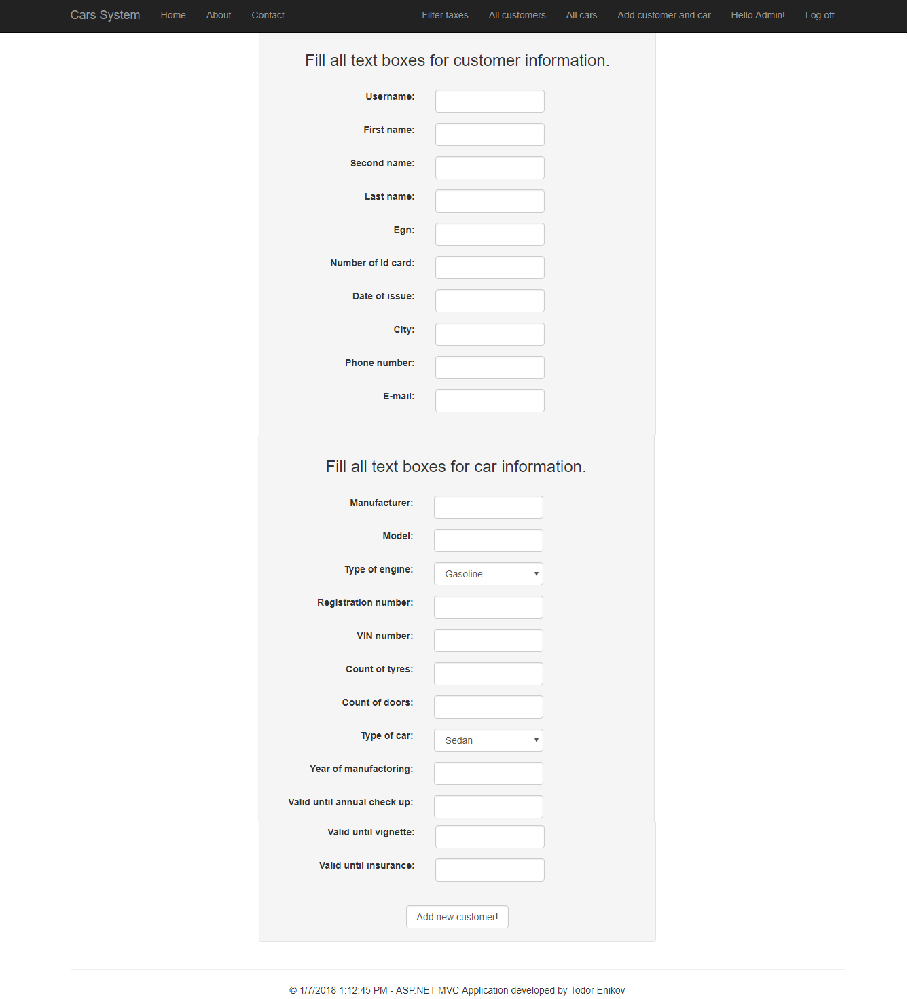
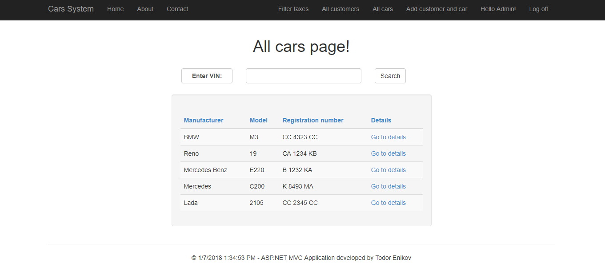

# Cars-System-ASP.NET-MVC-Project
Diploma work for my Master Degree in Technical University of Sofia.

### Project desctiption:
This is application made on ASP .NET MVC. It's purpose is to collect information about customers and their cars information. The application has administration panel and only user with role "Admin", can add information, about given customer and his car. The specific in this application is that the administrator of the application can filter cars by mannual check up, vignette and insurance expiration and on that base to send emails to thoose customers, which expiration is soon.

Roles in the application and what can they visit.
* Admin - can visit all pages in the application.
* Regular user - can visit home, about, contact, profile pages.
* Not registered user - can see only about, home, contact and login pages.

### Images from the application: 

## GitHub repository link:

https://github.com/todor-enikov/Cars-System-ASP.NET-MVC-Project

## Documentation folder includes:
  * Final documentation for TU - Sofia
  * Presentation for TU - Sofia
  * How to set up Task Scheduler to run the CarsSystemConsoleApp exe?
